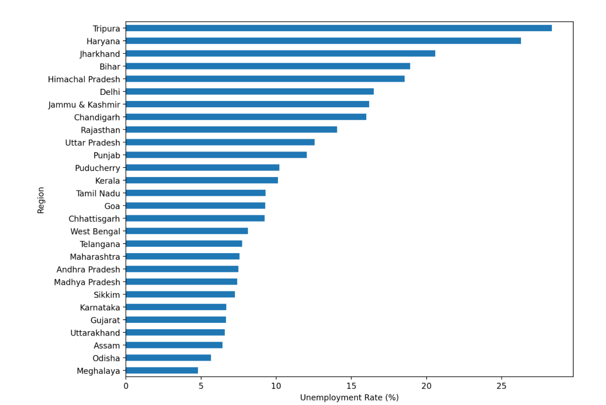
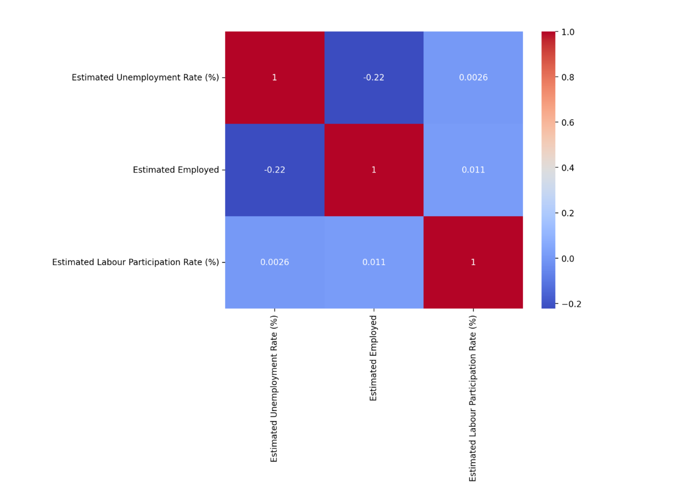
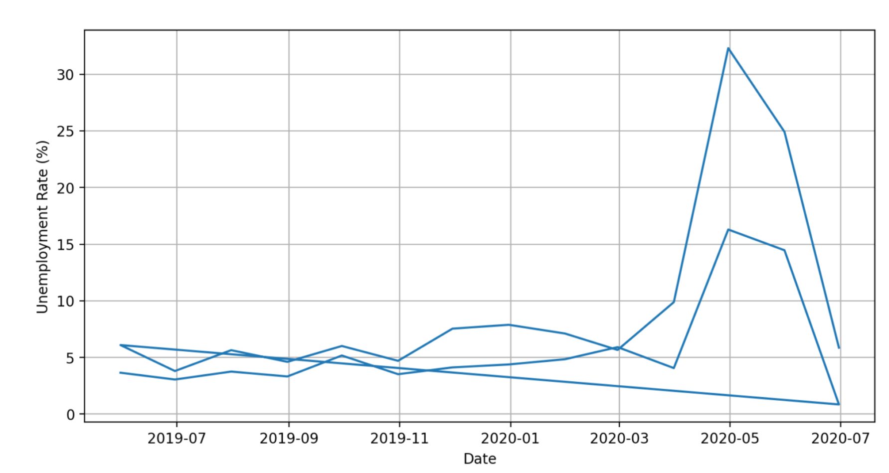
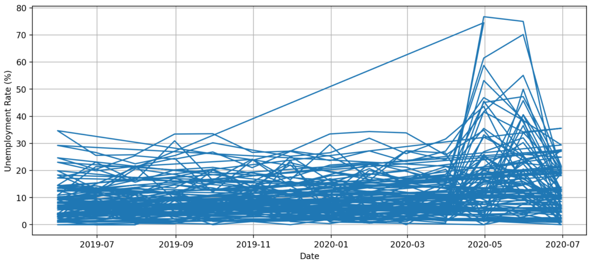

# 📊 Unemployment Analysis using Python

## 📌 Project Overview

This project focuses on analyzing unemployment trends in India using Python and data visualization techniques. The analysis helps understand unemployment patterns across different states and regions through graphical representations and statistical insights.

An interactive Streamlit web application is also developed to visualize unemployment trends, state-wise analysis, and regional comparisons in a simple and user-friendly dashboard.

---

# 🎯 Objective

The main objectives of this project are:

- Analyze unemployment trends in India
- Understand data analysis workflow
- Perform data preprocessing and visualization
- Identify states with high and low unemployment rates
- Compare unemployment trends region-wise
- Build an interactive dashboard using Streamlit

---

# 📂 Dataset Information

The project uses unemployment datasets containing unemployment rates from different states and regions of India.

| Feature                                 | Description               |
| --------------------------------------- | ------------------------- |
| State                                   | Name of the state         |
| Region                                  | Region category           |
| Date                                    | Time period of analysis   |
| Estimated Unemployment Rate (%)         | Unemployment percentage   |
| Estimated Employed                      | Number of employed people |
| Estimated Labour Participation Rate (%) | Labour participation rate |

---

# ⚙️ Technologies Used

- Python 🐍
- Pandas
- NumPy
- Matplotlib
- Seaborn
- Plotly
- Streamlit

---

# 📊 Project Workflow

1️⃣ Data Loading & Exploration

2️⃣ Data Cleaning & Preprocessing

3️⃣ Missing Values Analysis

4️⃣ Dataset Visualization

5️⃣ State-wise Unemployment Analysis

6️⃣ Region-wise Trend Analysis

7️⃣ Correlation Heatmap Generation

8️⃣ Statistical Insights Extraction

9️⃣ Data Visualization

🔟 Streamlit Dashboard Development

---

# 📈 Analysis & Results

- Identified states with high unemployment rates
- Compared unemployment trends across regions
- Visualized unemployment changes over time
- Generated heatmaps for correlation analysis
- Extracted insights from employment datasets

---

# 🖥️ Streamlit Dashboard Features

The web application includes:

✅ Dataset overview

✅ Dataset description

✅ Missing values analysis

✅ Unemployment trend over time

✅ Highest unemployment states analysis

✅ Lowest unemployment states analysis

✅ Average unemployment rate visualization

✅ Correlation heatmap

✅ Andhra Pradesh unemployment data

✅ Region-wise trend visualization

✅ Clean and responsive UI

---

# 🚀 How to Run the Project

## 1️⃣ Clone Repository

```bash
git clone https://github.com/dikshasinha01/CodeAlpha_Unemployment_Analysis.git
```

## 2️⃣ Open Project Folder

```bash
cd CodeAlpha_Unemployment_Analysis
```

## 3️⃣ Install Required Libraries

```bash
pip install -r requirements.txt
```

## 4️⃣ Run Streamlit Application

```bash
streamlit run app2.py
```

---

# 📁 Project Structure

```bash
CodeAlpha_UnemploymentAnalysis/
│
├── Output/
│   ├── average_unemployment_rate.png
│   ├── data_for_andhra_pradesh.csv
│   ├── dataset_description.csv
│   ├── dataset_overview.csv
│   ├── heatmap.png
│   ├── highest_unemployment_states.csv
│   ├── lowest_unemployment_states.csv
│   ├── missing_values.csv
│   ├── region_wise_trend.png
│   └── unemployment_trend_over_time.png
│
├── app2.py
├── requirements.txt
├── Unemployment in India.csv
├── unemployment_analysis.py
├── Unemployment_Rate_upto_11_2020.csv
├── README.md
```

---

# 📷 Project Screenshots

## 📈 Average Unemployment Rate



---

## 🔥 Correlation Heatmap



---

## 🌍 Region-wise Trend



---

## 📉 Unemployment Trend Over Time



---

# 📌 Key Learnings

This project helped me understand:

- Exploratory Data Analysis (EDA)
- Data preprocessing techniques
- Statistical data analysis
- Data visualization methods
- Streamlit dashboard development
- Real-world unemployment trend analysis

---

# 🎯 Future Improvements

- Add predictive unemployment forecasting
- Deploy project online
- Improve dashboard UI/UX
- Add interactive filters
- Integrate real-time datasets

---

# 👩‍💻 Author

### Diksha Sinha

B.Tech CSE Student

Data Analysis & Visualization Project
